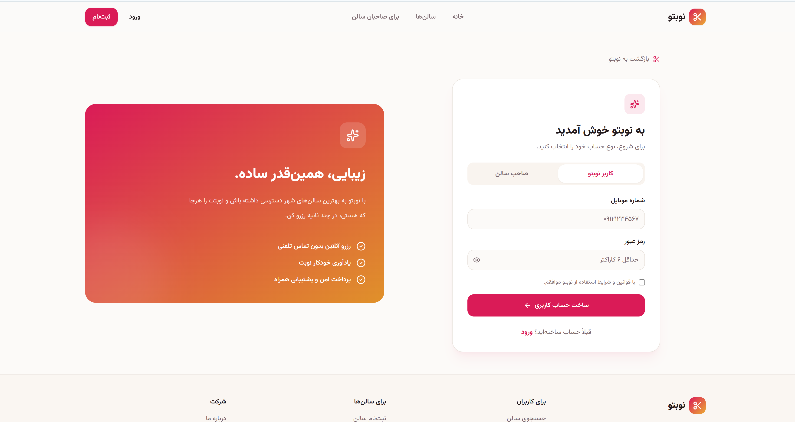
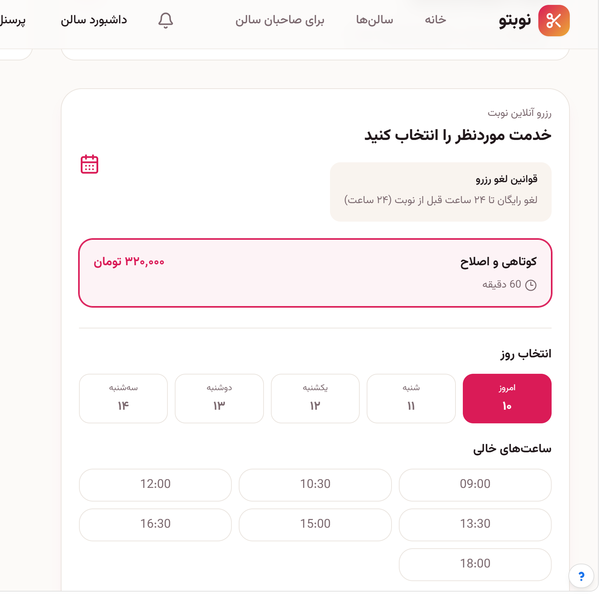
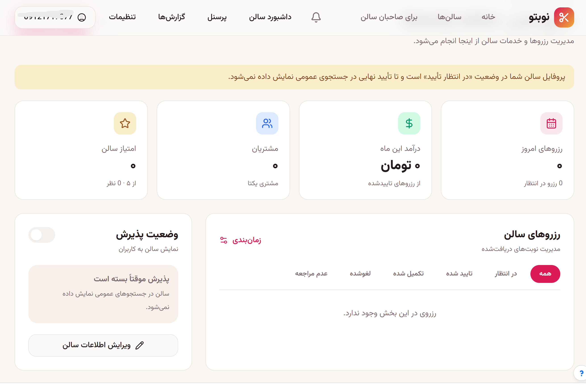

# Salon Booking Marketplace

A full-stack marketplace for booking appointments at women's and men's salons. Customers can discover salons, check real-time availability, book services with their preferred staff member, and pay online. Salon owners manage their staff, schedules, services, and reports, while platform admins oversee the whole marketplace.

## Screenshots

### Home


### Sign in



### Salons


### Booking



### Admin panel



## Features

**For customers**
- **Salon discovery** — browse salons and open detailed salon profiles
- **Availability-based booking** — pick a service, staff member, date, and time from the open slots
- **My bookings** — view, manage, and track upcoming and past appointments
- **Online payments** — pay for bookings, with payment result pages and refund support
- **Reviews** — rate and review salons after a visit
- **Favorites** — save the salons you like
- **Notifications** — stay updated about booking changes

**For salon owners**
- **Dashboard and calendar** — see all bookings at a glance
- **Staff management** — add staff and assign them to services
- **Availability control** — set working hours for the salon and for each staff member, plus exceptions such as holidays and days off
- **Salon settings** — manage the salon's profile and booking settings
- **Reports** — view booking and revenue reports

**For admins**
- **Admin dashboard** — oversee salons, users, and marketplace activity
- **Admin actions** — moderate and manage the platform

**Under the hood**
- Booking lifecycle service for status changes
- Availability engine that takes salon and staff schedules into account
- Request validation with Zod
- Database migrations, integration tests, and end-to-end tests

## Tech Stack

**Frontend**
- React 18 + TypeScript, built with Vite
- React Router and TanStack Query
- Tailwind CSS and shadcn/ui (Radix UI)
- Framer Motion for animations
- Recharts for reports

**Backend**
- Node.js + Express 5 + TypeScript
- PostgreSQL (`pg`) with TypeScript migrations
- Zod validation
- Repository and service layers

**Tooling and deployment**
- pnpm
- Vitest for unit, integration, and end-to-end tests
- Prettier and TypeScript type checking
- Netlify (static client + serverless API via `serverless-http`)

## Project Structure

```
Salon-booking-marketplace
├─ client/                  # React app
│  ├─ components/           # layout/, salon-card, ui/ (shadcn/ui)
│  ├─ hooks/                # use-mobile, use-toast
│  ├─ lib/                  # auth-context, salons-data, utils
│  └─ pages/                # Index, Salons, SalonProfile, MyBookings, Dashboard,
│                           # Schedule, Staff, StaffSchedule, SalonSettings,
│                           # OwnerReports, AdminDashboard, PaymentResult, ...
├─ server/                  # Express API
│  ├─ middleware/           # auth
│  ├─ migrations/           # Database migrations
│  ├─ repositories/         # booking, notification, owner-report
│  ├─ routes/               # salons, bookings, availability, payments, reviews,
│  │                        # favorites, notifications, owner-*, admin
│  ├─ services/             # booking, booking-lifecycle, notification,
│  │                        # owner-report
│  ├─ validators/           # Zod schemas
│  ├─ booking-availability.ts
│  ├─ payment-provider.ts
│  ├─ db.ts                 # PostgreSQL connection
│  └─ seed.ts               # Sample data
├─ shared/                  # Types shared by client and server
├─ docs/screenshots/        # App screenshots
├─ netlify/functions/       # Serverless API entry for Netlify
└─ netlify.toml
```

## Getting Started

### Prerequisites

- Node.js 18+
- pnpm
- A PostgreSQL database

### Installation

```bash
git clone https://github.com/mohjavad333/Salon-booking-marketplace
cd Salon-booking-marketplace
pnpm install
```

### Environment variables

Create a `.env` file in the project root and set the values the server needs:

```env
DATABASE_URL=your_postgres_connection_string
PORT=3000
```

If you use an online payment provider, add its credentials here as well (see `server/payment-provider.ts`).

### Seed the database

Load sample salons, staff, and services:

```bash
pnpm tsx server/seed.ts
```

### Run in development

```bash
pnpm dev
```

### Build and run in production

```bash
pnpm build
pnpm start
```

## Scripts

| Command | Description |
| --- | --- |
| `pnpm test` | Run unit, integration, and end-to-end tests with Vitest |
| `pnpm typecheck` | Run the TypeScript compiler |
| `pnpm format.fix` | Format the codebase with Prettier |

## Deployment

The repo includes `netlify.toml` and `netlify/functions/api.ts`, so the client can be deployed on Netlify with the API running as a serverless function. Set the same environment variables in your Netlify site settings.

## Roadmap

- [ ] Email and SMS booking reminders
- [ ] Discount codes and loyalty rewards
- [ ] Map-based salon search
- [ ] Mobile app


## Author

**Mohammad Javad Rezaei**
GitHub: [@ymohjavad333](https://github.com/mohjavad333/Salon-booking-marketplace)


<div dir="rtl">


# Salon Booking Marketplace — مارکت‌پلیس رزرو سالن

یک مارکت‌پلیس فول‌استک برای رزرو نوبت در سالن‌های زنانه و مردانه. مشتری‌ها می‌تونن سالن‌ها رو پیدا کنن، زمان‌های خالی رو ببینن، خدمات رو با آرایشگر دلخواه رزرو کنن و آنلاین پرداخت کنن. صاحبان سالن، پرسنل، برنامه‌ی کاری، خدمات و گزارش‌ها رو مدیریت می‌کنن و ادمین‌های پلتفرم بر کل مارکت‌پلیس نظارت دارن.


## امکانات

**برای مشتری‌ها**
- **کشف سالن‌ها** — مرور سالن‌ها و مشاهده‌ی پروفایل کامل هر سالن
- **رزرو بر اساس زمان‌های خالی** — انتخاب خدمت، آرایشگر، تاریخ و ساعت از بین زمان‌های آزاد
- **رزروهای من** — مشاهده، مدیریت و پیگیری نوبت‌های آینده و گذشته
- **پرداخت آنلاین** — پرداخت هزینه‌ی رزرو، همراه با صفحه‌ی نتیجه‌ی پرداخت و امکان بازپرداخت
- **نظرات** — ثبت امتیاز و نظر درباره‌ی سالن بعد از مراجعه
- **علاقه‌مندی‌ها** — ذخیره‌ی سالن‌های مورد علاقه
- **اعلان‌ها** — اطلاع از تغییرات رزرو

**برای صاحبان سالن**
- **داشبورد و تقویم** — مشاهده‌ی همه‌ی رزروها در یک نگاه
- **مدیریت پرسنل** — افزودن پرسنل و تخصیص اون‌ها به خدمات
- **کنترل زمان‌های کاری** — تنظیم ساعت کاری سالن و هر عضو پرسنل، همراه با استثناها مثل تعطیلی و مرخصی
- **تنظیمات سالن** — مدیریت پروفایل و تنظیمات رزرو سالن
- **گزارش‌ها** — مشاهده‌ی گزارش رزروها و درآمد

**برای ادمین‌ها**
- **داشبورد ادمین** — نظارت بر سالن‌ها، کاربران و فعالیت‌های مارکت‌پلیس
- **عملیات ادمین** — مدیریت و کنترل پلتفرم

**زیرساخت**
- سرویس چرخه‌ی عمر رزرو برای مدیریت تغییر وضعیت‌ها
- موتور محاسبه‌ی زمان‌های خالی که برنامه‌ی سالن و پرسنل رو در نظر می‌گیره
- اعتبارسنجی درخواست‌ها با Zod
- مایگریشن دیتابیس، تست‌های یکپارچگی و تست‌های End-to-End

## تکنولوژی‌های استفاده‌شده

**فرانت‌اند**
- React 18 + TypeScript با Vite
- React Router و TanStack Query
- Tailwind CSS و shadcn/ui (بر پایه‌ی Radix UI)
- Framer Motion برای انیمیشن
- Recharts برای گزارش‌ها

**بک‌اند**
- Node.js + Express 5 + TypeScript
- PostgreSQL (`pg`) با مایگریشن‌های TypeScript
- اعتبارسنجی با Zod
- لایه‌های Repository و Service

**ابزارها و دیپلوی**
- pnpm
- Vitest برای تست واحد، یکپارچگی و End-to-End
- Prettier و بررسی تایپ با TypeScript
- Netlify (کلاینت استاتیک + API سرورلس با `serverless-http`)

## ساختار پروژه

```
Salon-booking-marketplace
├─ client/                  # اپلیکیشن React
│  ├─ components/           # layout/, salon-card, ui/ (shadcn/ui)
│  ├─ hooks/                # use-mobile, use-toast
│  ├─ lib/                  # auth-context, salons-data, utils
│  └─ pages/                # Index, Salons, SalonProfile, MyBookings, Dashboard,
│                           # Schedule, Staff, StaffSchedule, SalonSettings,
│                           # OwnerReports, AdminDashboard, PaymentResult, ...
├─ server/                  # API با Express
│  ├─ middleware/           # auth
│  ├─ migrations/           # مایگریشن‌های دیتابیس
│  ├─ repositories/         # booking, notification, owner-report
│  ├─ routes/               # salons, bookings, availability, payments, reviews,
│  │                        # favorites, notifications, owner-*, admin
│  ├─ services/             # booking, booking-lifecycle, notification,
│  │                        # owner-report
│  ├─ validators/           # اسکیماهای Zod
│  ├─ booking-availability.ts
│  ├─ payment-provider.ts
│  ├─ db.ts                 # اتصال به PostgreSQL
│  └─ seed.ts               # داده‌ی نمونه
├─ shared/                  # تایپ‌های مشترک بین کلاینت و سرور
├─ docs/screenshots/        # اسکرین‌شات‌های برنامه
├─ netlify/functions/       # نقطه‌ی ورود API سرورلس برای Netlify
└─ netlify.toml
```

## راه‌اندازی

### پیش‌نیازها

- Node.js نسخه‌ی 18 یا بالاتر
- pnpm
- یک دیتابیس PostgreSQL

### نصب

```bash
git clone https://github.com/mohjavad333/Salon-booking-marketplace
cd Salon-booking-marketplace
pnpm install
```

### متغیرهای محیطی

یک فایل `.env` توی ریشه‌ی پروژه بساز و مقادیری که سرور نیاز داره رو توش بذار:

```env
DATABASE_URL=your_postgres_connection_string
PORT=3000
```

اگه از درگاه پرداخت آنلاین استفاده می‌کنی، اطلاعات اون رو هم اینجا اضافه کن (فایل `server/payment-provider.ts` رو ببین).

### پر کردن دیتابیس با داده‌ی نمونه

سالن‌ها، پرسنل و خدمات نمونه رو بارگذاری می‌کنه:

```bash
pnpm tsx server/seed.ts
```

### اجرا در حالت توسعه

```bash
pnpm dev
```

### بیلد و اجرا در حالت پروداکشن

```bash
pnpm build
pnpm start
```

## اسکریپت‌ها

| دستور | توضیح |
| --- | --- |
| `pnpm test` | اجرای تست‌های واحد، یکپارچگی و End-to-End با Vitest |
| `pnpm typecheck` | اجرای کامپایلر TypeScript |
| `pnpm format.fix` | فرمت کردن کد با Prettier |

## دیپلوی

پروژه شامل `netlify.toml` و `netlify/functions/api.ts` هست، پس می‌تونی کلاینت رو روی Netlify دیپلوی کنی و API رو به‌صورت تابع سرورلس اجرا کنی. همون متغیرهای محیطی رو توی تنظیمات سایت Netlify هم وارد کن.

## نقشه‌ی راه

- [ ] یادآور رزرو با ایمیل و پیامک
- [ ] کد تخفیف و برنامه‌ی وفاداری
- [ ] جستجوی سالن روی نقشه
- [ ] اپلیکیشن موبایل


## توسعه‌دهنده

**محمدجواد رضایی**
GitHub: [@mohjavad333](https://github.com/mohjavad333/Salon-booking-marketplace)

</div>